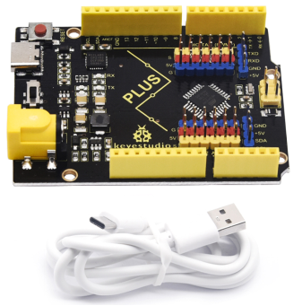
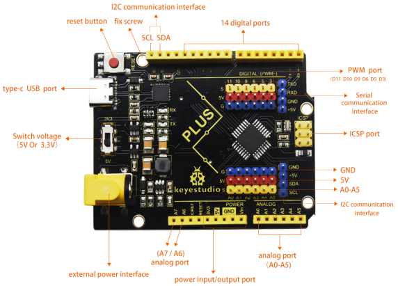

# Keyestudio PLUS Control Board(Black and Eco-friendly)

## Description

Doing experiments with electronic products, we often program on the ArduinoIDE development environment with Arduino series microcontrollers. Keyestudio PLUS control board is fully compatible with Arduino IDE developmentenvironment. It is as same as the Arduino UNO R3 board. Moreover, some improvements we made highly strengthen its function(as shown below). In order to wire efficiently, we equip it with a 1m USB cable with type-c interface for you. 

## Specification

- Microcontroller: ATMEGA328P-AU
- USB to serial chip: CP2102
- Working voltage: 5V or 3.3V(DIP switch control)
- External power: DC 6-15V(recommend 9V)Digital I/O pins: 14(D0-D13)
- PWM channel: 6 (D3 D5 D6 D9 D10 D11)Analog input channel (ADC): 8(A0-A7)

- Each I/ O Port of DC output capability: 20 mAOutput capability of 3.3V port: 50 mA
- Flash Memory: 32 KB (of which 0.5 KB is used by the bootloader)
- SRAM: 2 KB(ATMEGA328P-AU)
- EEPROM: 1 KB(ATMEGA328P-AU)
- Clock speed: 16MHzOn-board LED pin: D13 

## Interfaces

## Specialized Functions of Some Pins:

- Serial communication interface: DO is RX, D1 is TX
- PWM interface (pulse width modulation): D3 D5 D6 D9 D10 D11 
- External interrupt interface: D2 (interrupt 0) and D3 (interrupt 1) 
- SPI communication interface: D10 is SS, D11 is MOSI, D12 is MISO, D13 is SCK
- IIC communication port: A4 is SDA, A5 is SCL 

